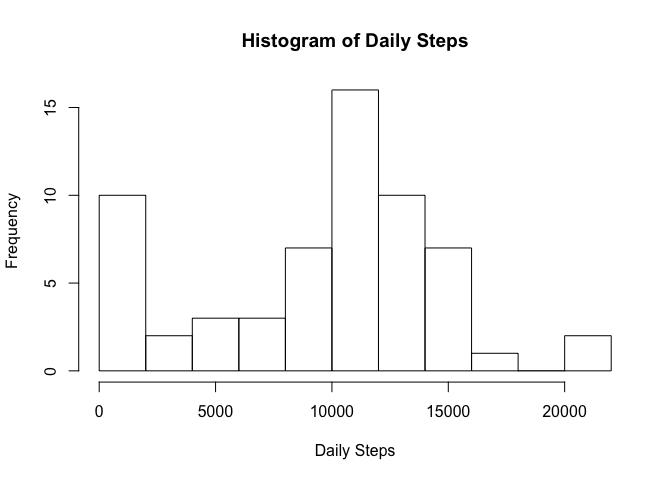
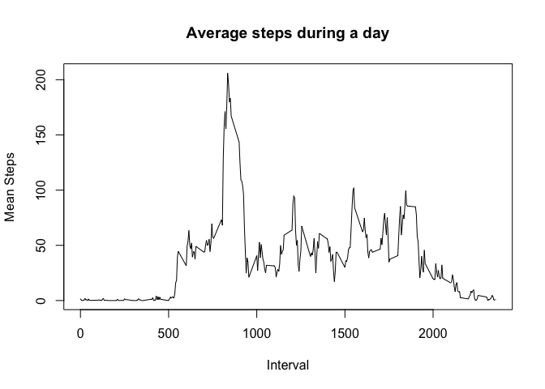
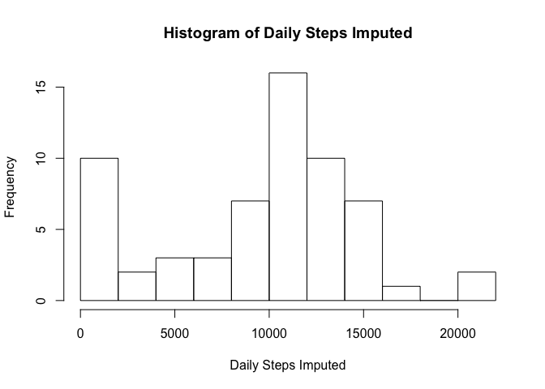

# Reproducible Research: Peer Assessment 1
## Loading libraries

```r
library(plyr)
library(dplyr)
```

```
## 
## Attaching package: 'dplyr'
## 
## The following objects are masked from 'package:plyr':
## 
##     arrange, count, desc, failwith, id, mutate, rename, summarise,
##     summarize
## 
## The following objects are masked from 'package:stats':
## 
##     filter, lag
## 
## The following objects are masked from 'package:base':
## 
##     intersect, setdiff, setequal, union
```


```r
knitr::opts_chunk$set(fig.path = 'figure/')
```

## Loading and preprocessing the data

```r
activity <- read.csv("activity.csv")
str(activity)
```

```
## 'data.frame':	17568 obs. of  3 variables:
##  $ steps   : int  NA NA NA NA NA NA NA NA NA NA ...
##  $ date    : Factor w/ 61 levels "2012-10-01","2012-10-02",..: 1 1 1 1 1 1 1 1 1 1 ...
##  $ interval: int  0 5 10 15 20 25 30 35 40 45 ...
```

## What is mean total number of steps taken per day?
### Histogram of the total number of steps taken each day

```r
activity_by_date <- group_by(activity, date)
activity_sum_by_date <- summarise(activity_by_date, daily_steps = sum(steps, na.rm = TRUE))
hist(activity_sum_by_date$daily_steps, breaks = 10, xlab = "Daily Steps", main = "Histogram of Daily Steps")
```

 

### Mean and median total number of steps taken per day

```r
mean_steps <- mean(activity_sum_by_date$daily_steps)
median_steps <- median(activity_sum_by_date$daily_steps)
```
The mean steps taken per day are 9354.2295082.

The median steps taken per day are 10395.

## What is the average daily activity pattern?

### Make a time series plot (i.e. type = "l") of the 5-minute interval (x-axis) and the average number of steps taken, averaged across all days (y-axis)

```r
activity_by_interval <- group_by(activity, interval)
activity_mean_by_interval <- summarise(activity_by_interval, mean_steps = mean(steps, na.rm = TRUE))
plot(activity_mean_by_interval$interval, activity_mean_by_interval$mean_steps, type = "l", xlab = "Interval", ylab = "Mean Steps", main = "Average steps during a day")
```

 

### Which 5-minute interval, on average across all the days in the dataset, contains the maximum number of steps?

```r
max_steps_interval <- filter(activity_mean_by_interval, mean_steps == max(mean_steps))
max_interval <- max_steps_interval$interval[1]
max_steps <- max_steps_interval$mean_steps[1]
```
The 5-minute interval 835 has the maximum average steps of 206.1698113 steps.

## Imputing missing values
### Rows with NAs

```r
activityWithNa <- filter(activity, is.na(steps) | is.na(date) | is.na(interval))
numberOfRowsWithNa <- dim(activityWithNa)[1]
```
There are 2304 rows with NA values.

### Filling missing values
Let's assume that we are very strict, so we set all NA values to 0.

```r
activity_imputed <- mutate(activity, steps_imputed = steps %>% mapvalues(NA, 0))
head(activity_imputed)
```

```
##   steps       date interval steps_imputed
## 1    NA 2012-10-01        0             0
## 2    NA 2012-10-01        5             0
## 3    NA 2012-10-01       10             0
## 4    NA 2012-10-01       15             0
## 5    NA 2012-10-01       20             0
## 6    NA 2012-10-01       25             0
```

### Histogram with imputed values

```r
activity_imputed_by_date <- group_by(activity_imputed, date)
activity_imputed_sum_by_date <- summarise(activity_imputed_by_date, daily_steps = sum(steps_imputed))
hist(activity_imputed_sum_by_date$daily_steps, breaks = 10, xlab = "Daily Steps Imputed", main = "Histogram of Daily Steps Imputed")
```

 

### Mean and median total number of steps taken per day

```r
mean_steps_imputed <- mean(activity_imputed_sum_by_date$daily_steps)
median_steps_imputed <- median(activity_imputed_sum_by_date$daily_steps)
```
The mean steps taken per day are 9354.2295082 (without imputing values it was 9354.2295082).

The median steps taken per day are 1.0395\times 10^{4} (without imputing values it was 10395).

## Are there differences in activity patterns between weekdays and weekends?
